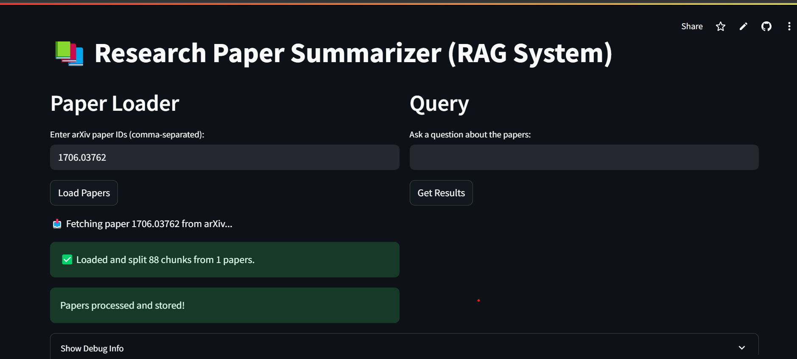
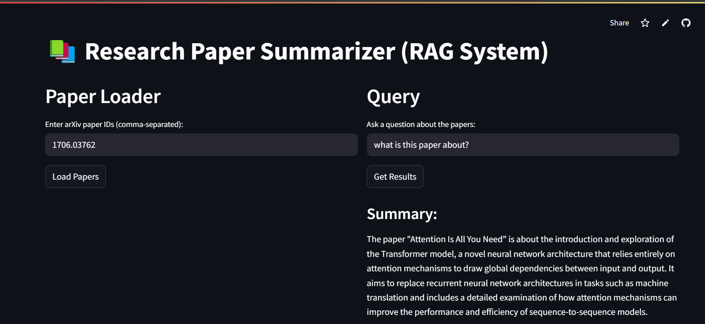

# 📚 Research Paper Summarizer (RAG System)

An interactive app that summarizes and answers questions from arXiv research papers using Retrieval-Augmented Generation (RAG), OpenAI’s GPT-4o, and HuggingFace embeddings.

---

## 🚀 Features

- 🔎 **arXiv Integration**: Load research papers directly using their arXiv IDs  
- 📄 **Document Chunking**: Intelligent splitting using LangChain’s RecursiveCharacterTextSplitter  
- 🧠 **Vector Search**: Embeddings stored in FAISS vectorstore for fast similarity search  
- 🤖 **RAG-based Summarization**: Combines vector retrieval + GPT-4o response generation  
- 🧪 **Query Engine**: Ask custom questions about the paper, and get precise answers

---

## 🛠️ Tech Stack

| Tool/Library | Purpose |
|:--|:--|
| Streamlit | Frontend UI |
| LangChain | Chaining logic and document loading |
| HuggingFace Transformers | Embeddings (`all-MiniLM-L6-v2`) |
| FAISS | Vector similarity search |
| OpenAI GPT-4o | LLM for generation |
| dotenv | API key management |

---

## 🖼️ Demo Screenshot

<p align="center">
  
  
</p>

---

## 📦 Setup Instructions

```bash
# 1. Clone the repo
git clone https://github.com/nishantsingh-ds/langchain-research-paper-summarizer.git
cd langchain-research-paper-summarizer

# 2. Create virtual environment (optional but recommended)
python -m venv venv
source venv/bin/activate  # or venv\Scripts\activate on Windows

# 3. Install dependencies
pip install -r requirements.txt

# 4. Add your API keys
# Create a .env file with the following:
OPENAI_API_KEY=your_openai_api_key
HF_TOKEN=your_huggingface_token

# 5. Run the app
streamlit run app.py
